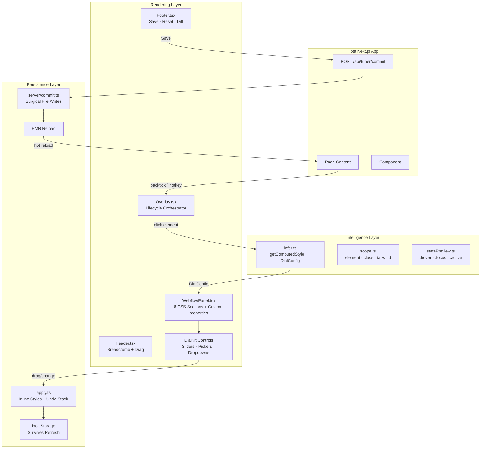
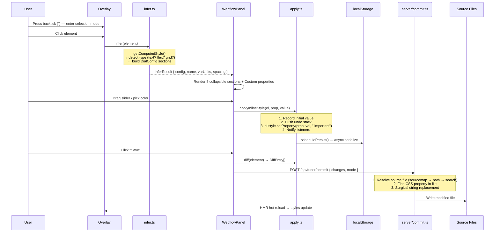
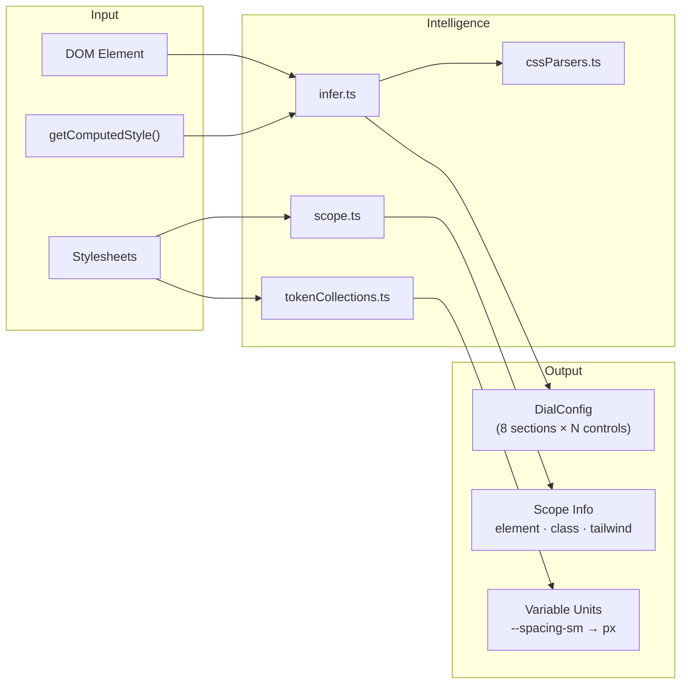
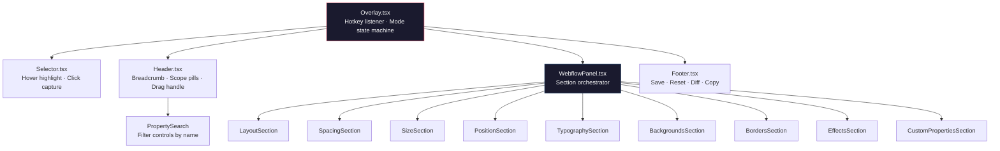
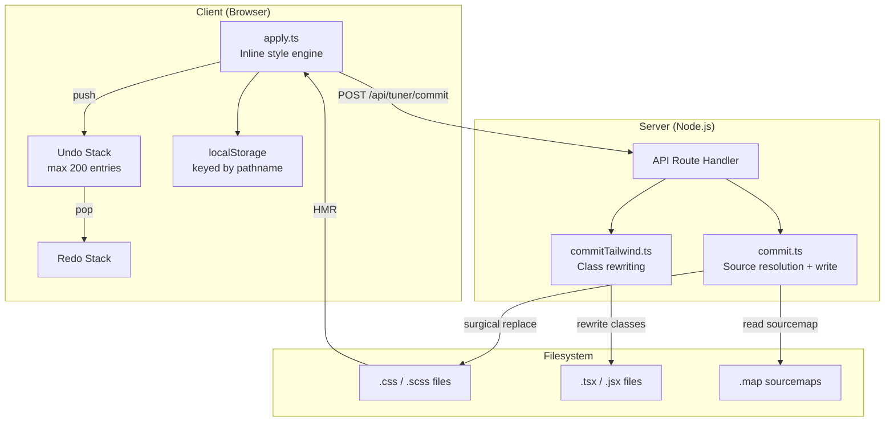
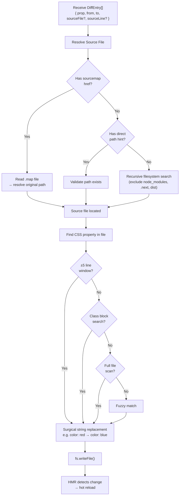
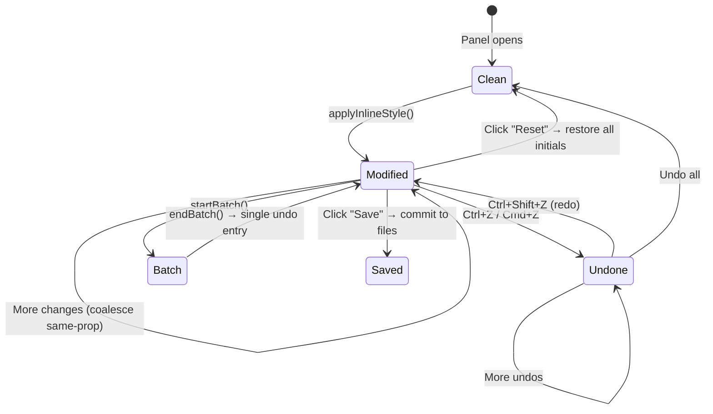
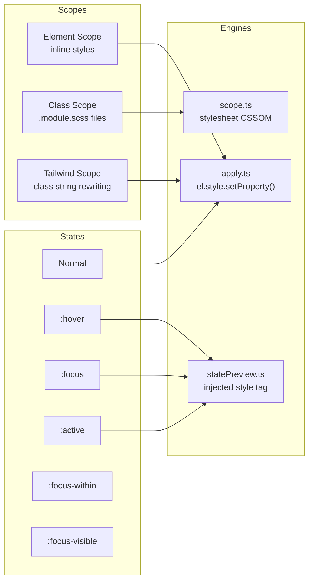
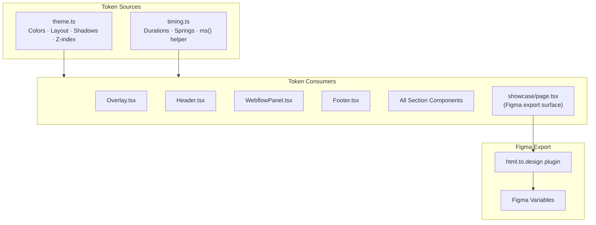
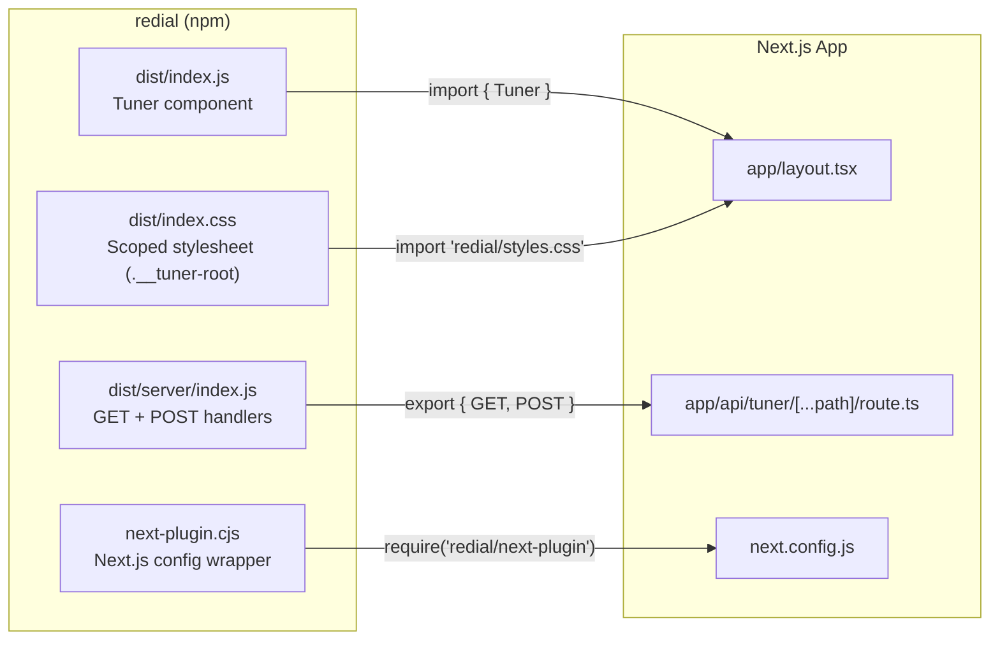

# Redial — Architecture Documentation

> A floating Webflow-style CSS tuning panel for Next.js. Click any element, get context-aware controls, drag to tune, save to source files via HMR.

---

## Table of Contents

1. [System Overview](#system-overview)
2. [Core Data Flow](#core-data-flow)
3. [Layer Architecture](#layer-architecture)
4. [Component Tree](#component-tree)
5. [File Persistence Pipeline](#file-persistence-pipeline)
6. [Undo/Redo System](#undoredo-system)
7. [Scope & State System](#scope--state-system)
8. [Design Token Architecture](#design-token-architecture)
9. [Package Exports & Integration](#package-exports--integration)
10. [Directory Map](#directory-map)

---

## System Overview

Redial is structured as three cooperating layers that transform a DOM element into live, saveable CSS controls:



---

## Core Data Flow

The complete lifecycle from element selection to file persistence:



---

## Layer Architecture

### Intelligence Layer

Transforms raw DOM state into structured control configurations.



**Sections generated by `infer.ts`:**

| Section | Properties | Condition |
|---------|-----------|-----------|
| Layout | display, flexbox, grid, overflow | Always |
| Spacing | margin, padding (all sides) | Always |
| Size | width, height, min/max, aspect-ratio | Always |
| Position | position, top/right/bottom/left, z-index | Always |
| Typography | font-size, weight, color, line-height, letter-spacing | Text-bearing elements |
| Backgrounds | background-color, gradient, image, blend-mode | Always |
| Borders | border width/color/radius, outline | Always |
| Effects | opacity, box-shadow, filter, backdrop-filter, transform | Always |
| Custom properties | arbitrary user-added CSS declarations (escape hatch) | Always (9th section) |

### Rendering Layer

React component hierarchy that presents controls to the user.



### Persistence Layer

Manages inline style application, undo history, and server-side file commits.



---

## File Persistence Pipeline

The server-side commit process uses a tiered resolution strategy:



---

## Undo/Redo System



**Key behaviors:**
- **Coalescing** — consecutive drags on the same property don't create multiple undo entries
- **Batching** — multi-step operations (e.g., paste styles) collapse into one undo entry
- **State-keyed** — pseudo-class overrides (`:hover`, `:focus`) stored separately with `"state::prop"` composite keys
- **Max depth** — 200 entries, oldest dropped on overflow

---

## Scope & State System

Redial supports editing at three scopes and multiple pseudo-states:



---

## Design Token Architecture

All visual constants flow from two canonical files:



**`theme.ts` token groups:**

| Group | Examples |
|-------|---------|
| `color` | `background`, `foreground`, `mutedForeground`, `primary`, `border`, `input` |
| `darkToolbar` | Dark toolbar / FAB surface tokens |
| `layout` | `panelWidth: 340`, `panelRadius: 10`, `labelWidth: 64` |
| `zIndex` | `max: 2147483647`, `overlay`, `guide`, `backdrop` |
| `shadow` | `panel`, `panelDrag`, `dropdown`, `picker` |
| `indicatorColor` | Cascade provenance (ADR-0007): `authored-here` (blue), `inherited` (orange), `element-inline` (pink), `state` (green), `modified` (amber), `none` |
| `spacingZone` | Zone colors for box-model visualization |

**`timing.ts` tokens:**

| Token | Duration | Use |
|-------|----------|-----|
| `instant` | 50ms | Immediate feedback |
| `micro` | 60ms | Micro-interactions |
| `fast` | 80ms | Hover states |
| `normal` | 100ms | Default transitions |
| `release` | 120ms | Press-release spring-back |
| `expand` | 150ms | Section expand/collapse |
| `layout` | 200ms | Panel reflows |
| `slow` | 300ms | Cross-fades |
| `toolbar` | 400ms | Toolbar slide |
| `dismissal` | 1700ms | Toast auto-dismiss |

---

## Package Exports & Integration



**Minimal integration (3 files):**

```tsx
// 1. app/layout.tsx
import { Tuner } from "redial";
import "redial/styles.css";
export default function Layout({ children }) {
  return <html><body>{children}<Tuner /></body></html>;
}

// 2. app/api/tuner/[...path]/route.ts
export { GET, POST } from "redial/server";

// 3. next.config.js (optional)
const withTuner = require("redial/next-plugin");
module.exports = withTuner({ /* next config */ });
```

---

## Directory Map

`src/overlay/` is organized into 8 subdirectories plus shared root utilities.
The per-file map lives in [`src/overlay/DIRECTORY.md`](src/overlay/DIRECTORY.md)
— read that first for any task.

```
redial/
├── src/
│   ├── index.tsx                    # Entry — exports Tuner component (SSR-safe mount gate)
│   ├── overlay/
│   │   ├── DIRECTORY.md             # Per-file module map — read this first
│   │   ├── core/                    # Engine (no UI): apply.ts (styles + undo/redo),
│   │   │                            #   engine.ts (unified facade), infer.ts, scope.ts,
│   │   │                            #   statePreview.ts, sourcemap.ts, commitUtils.ts, …
│   │   ├── controls/                # Shared UI primitives (Section, SliderRow, ColorRow, …)
│   │   ├── sections/                # 8 style sections + Custom properties + sub-editors
│   │   ├── shell/                   # Panel frame: Overlay.tsx (entry), Header, Footer,
│   │   │                            #   WebflowPanel, Toolbar, modals, drawers
│   │   ├── variables/               # Variable/token discovery, linking, collections
│   │   ├── overlays/                # On-page overlays (box model, grid, flex gap, spacing)
│   │   ├── navigator/               # DOM tree panel + CSS editor tab
│   │   ├── hooks/                   # 20 shared hooks (hotkeys, drag, selection, tracking, …)
│   │   ├── util/                    # boxGeometry.ts — pure box-model math
│   │   ├── theme.ts                 # Design tokens (single source of truth)
│   │   ├── timing.ts                # Animation timing tokens
│   │   └── …                        # Root utilities: cssParsers, colorUtils, unitConversion,
│   │                                #   breakpoints, breakpointPreview, tailwind, panelUtils, …
│   ├── server/
│   │   ├── index.ts                 # API route handler (GET + POST)
│   │   ├── commit.ts                # Source resolution + file write
│   │   ├── commitTailwind.ts        # Tailwind class rewriting
│   │   ├── pathSafety.ts            # Path containment guards
│   │   └── sourceMapCache.ts        # Source map caching
│   ├── lib/                         # Shared client/server helpers (css.ts, protocol.ts)
│   └── styles/                      # Scoped stylesheet (globals.css)
├── test-app/
│   ├── app/
│   │   ├── layout.tsx               # Mounts Tuner via TunerProvider
│   │   ├── demo/page.tsx            # Auto-opens panel (1:1 demo)
│   │   ├── showcase/page.tsx        # Token reference + Figma export
│   │   └── api/tuner/[...path]/     # Commit endpoint
│   └── package.json
├── package.json                     # Library metadata + exports
├── tsup.config.ts                   # Build (TS → ESM)
├── vitest.config.ts                 # Test configuration
├── next-plugin.cjs                  # Optional Next.js plugin
└── webflow-style-panel-spec.md      # Full UI spec (13 sections)
```

---

## Hotkey Reference

All shortcuts live in one capture-phase listener (`hooks/useOverlayHotkeys.ts`);
the in-app `?` overlay (`shell/ShortcutsHelp.tsx`) is the canonical list.

| Key | Action |
|-----|--------|
| `` ` `` (backtick) | Toggle selection mode / close panel |
| `Escape` | Dismiss modal → close search → close panel |
| `Cmd/Ctrl + Z` | Undo |
| `Cmd/Ctrl + Shift + Z` | Redo |
| `Cmd/Ctrl + S` | Save to source |
| `Cmd/Ctrl + C` | Copy CSS |
| `Cmd/Ctrl + Alt + C` / `+ V` | Copy / paste styles between elements |
| `Cmd/Ctrl + Shift + V` | Import CSS from clipboard |
| `Cmd/Ctrl + K` | Command palette |
| `Cmd/Ctrl + F`, `/` | Property search |
| `D` (hold) | Diff peek (strips overrides while held) |
| `S` | Cycle scope (element ↔ class) |
| `Alt + Shift + S` | Toggle focus mode |
| `R` / `Shift + R` | Reset element / reset all |
| `P` | Pin / unpin element |
| `N` | Toggle navigator |
| `H` | Toggle changes drawer (history tab) |
| `M` / `G` | Toggle box model / grid overlay |
| `T` | Toggle Style / AI tab |
| `1`–`8` | Jump to section |
| `[` / `]` | Cycle sections |
| `↑ ↓ ← →` | Navigate elements (parent / child / siblings) |
| `?` | Shortcuts help |

**Context-aware pass-through** (`hotkeyPageHijacking.test.tsx` pins this matrix —
the overlay must never hijack the host page):

- `Cmd+F` / `Cmd+K` — claimed **only** while focus is inside the tuner UI
  (`.__tuner-root` or `[data-tuner-portal]`). On the page, browser find and
  host command palettes keep working.
- `Cmd+C` — passes through when the page has a text selection, when a text
  control holds a range selection, or when focus is in a host editing surface;
  otherwise claimed (copy CSS).
- `Cmd+Z` / `Cmd+Shift+Z` — claimed inside the tuner UI (including panel
  inputs); pass through in host text fields (native undo wins); on the page,
  claimed only when the style engine actually has a step to revert/replay.
- `Cmd+S` — claimed globally while the panel is open (blocks the browser save
  dialog).
- Plain-key shortcuts (`S`, `R`, `D`, arrows, digits, …) never fire while
  typing in inputs or while focus is inside the panel/portals.
